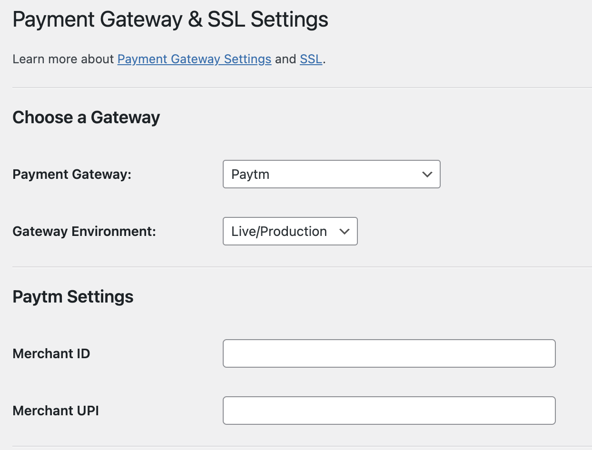
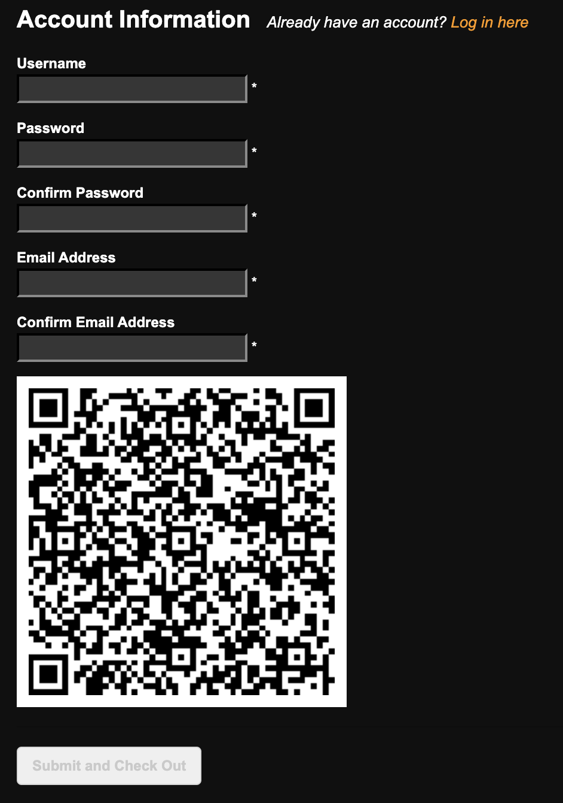

# PMPRO Paytm Gateway Addon

This is an addon plugin for Paid membership pro plugin (pmpro). PMPRO offers various gateways like Stripe, Paypal express, Braintree, etc. Currently, it doesn't support Paytm gateway.

So, this addon aims to solve the issue by integrating paytm gateway. Currently, it generates the QR code on checkout page which a payee can scan through mobile/any scanner (Google Lens). This will directly open up the UPI app if installed on mobile else prompt to install a suitable app.

## Limitations
- Works only for Paytm. A payee must pay through Paytm. Phonepe, Google Pay are not expected.
- Only UPI payment is allowed. No debit/credit card or net banking payment is available.
- Only one time payment is supported. Recurring payments are not supported. Be informed that in case of recurring payment, it may behave unexpectedly.
- Taxes are not taken into consideration. Even though you may provide taxes from options, but they are not calculated in final payment amount.

## Usage

1. Addon provides two options named - Merchant UPI and merchant ID. One can get merchant ID from Paytm business. These fields are mandatory to be configured before making any payment
   
2. Create some non-recurring levels from settings of PMPRO.
3. Go to membership levels page.
4. Scroll down to submit button where you can see a QR code.
   
5. One can scan the code and do payment.
6. If submitted without payment, it will throw an error and one can re-try again. On successful payment, it redirects to membership account page.

